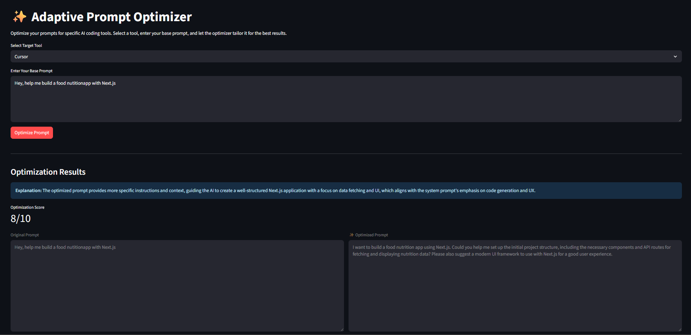

# Adaptive Prompt Optimizer


A tool to optimize prompts for various AI coding assistants.

## Setup

1.  Install dependencies:
    ```bash
    pip install -r requirements.txt
    ```

2.  Create a `.env` file and add your Google API key:
    ```
    GOOGLE_API_KEY="YOUR_API_KEY_HERE"
    ```

3.  Run the Streamlit app:
    ```bash
    streamlit run app.py
    ``` 