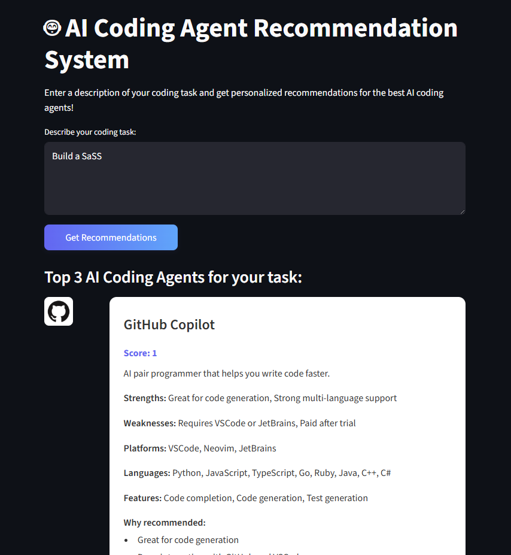

# AI Coding Agent Recommendation System



## 1. Overview

The AI Coding Agent Recommendation System is a web application designed to help developers choose the best AI coding agent (e.g., GitHub Copilot, Cursor, Replit AI) for their specific programming tasks. By inputting a natural language description of a task, the system analyzes the requirements and recommends the top 3 most suitable agents with clear justifications.

This project aims to simplify the decision-making process for developers, ensuring they select the right tool to enhance their productivity and workflow.

---

## 2. Features

-   **Natural Language Task Analysis:** Understands user-provided task descriptions to identify key requirements.
-   **Intelligent Recommendations:** Ranks and suggests the top 3 AI coding agents based on a scoring algorithm.
-   **Detailed Justifications:** Provides clear reasons for each recommendation, highlighting agent strengths.
-   **Curated Knowledge Base:** Maintains up-to-date information on a wide range of popular coding agents.
-   **User-Friendly Interface:** A simple, interactive web UI built with Streamlit for a seamless experience.

---

## 3. Technical Stack

-   **Backend:** **FastAPI**
-   **Frontend:** **Streamlit**
-   **Core Logic:** Python

---

## 4. Project Structure

```
ai_coding_agent_recommendation_system/
│
├── backend/
│   ├── main.py           # FastAPI app
│   ├── agent_data.py     # Agent knowledge base
│   ├── recommender.py    # Task analysis & recommendation logic
│   └── requirements.txt
│
├── frontend/
│   ├── app.py            # Streamlit app
│   └── requirements.txt
│
├── README.md             # This file
└── project.md            # Product Requirements Document
```

---

## 5. Setup and Installation

Follow these steps to set up and run the project locally.

### Prerequisites

-   Python 3.8+
-   `pip` and `venv`

### Installation

1.  **Clone the repository:**
    ```sh
    git clone <your-repository-url>
    cd ai_coding_agent_recommendation_system
    ```

2.  **Set up the Backend:**
    ```sh
    # Navigate to the backend directory
    cd backend

    # Create and activate a virtual environment
    python -m venv venv
    source venv/bin/activate  # On Windows, use `venv\Scripts\activate`

    # Install dependencies
    pip install -r requirements.txt
    ```

3.  **Set up the Frontend:**
    ```sh
    # Navigate to the frontend directory from the root
    cd ../frontend

    # Create and activate a virtual environment
    python -m venv venv
    source venv/bin/activate  # On Windows, use `venv\Scripts\activate`

    # Install dependencies
    pip install -r requirements.txt
    ```

---

## 6. Usage

To run the application, you need to start both the backend server and the frontend app in separate terminal windows.

1.  **Start the Backend Server:**
    -   Open a terminal and navigate to the `backend` directory.
    -   Activate the virtual environment: `source venv/bin/activate`
    -   Run the FastAPI server:
        ```sh
        uvicorn main:app --reload
        ```
    -   The backend API will be available at `http://127.0.0.1:8000`.

2.  **Start the Frontend Application:**
    -   Open a second terminal and navigate to the `frontend` directory.
    -   Activate the virtual environment: `source venv/bin/activate`
    -   Run the Streamlit app:
        ```sh
        streamlit run app.py
        ```
    -   The frontend will be accessible in your browser, typically at `http://localhost:8501`.

3.  **Use the Application:**
    -   Open your browser to the Streamlit URL.
    -   Enter a description of your coding task in the input box.
    -   Click "Get Recommendations" to see the top 3 AI coding agents for your task.

---

## 7. API Endpoint

The backend exposes the following endpoint:

-   **`POST /recommend`**
    -   **Description:** Accepts a task description and returns the top 3 agent recommendations.
    -   **Request Body:**
        ```json
        {
          "task_description": "Your coding task here..."
        }
        ```
    -   **Response:**
        ```json
        [
          {
            "name": "Agent Name",
            "justification": "Why this agent is recommended...",
            ...
          }
        ]
        ```

---

## 8. Future Enhancements

-   **Advanced NLP:** Integrate a powerful LLM for more accurate task analysis.
-   **User Feedback:** Allow users to rate and provide feedback on recommendations.
-   **Expanded Knowledge Base:** Add more coding agents and richer data points.
-   **Automated Data Updates:** Implement a scraper to keep agent information current.

---

## 9. Contact

For questions or contributions, please contact the project maintainer. 